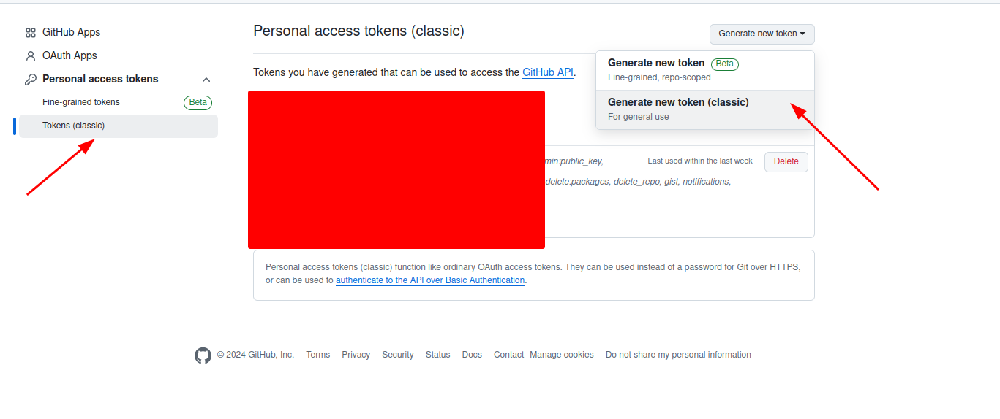
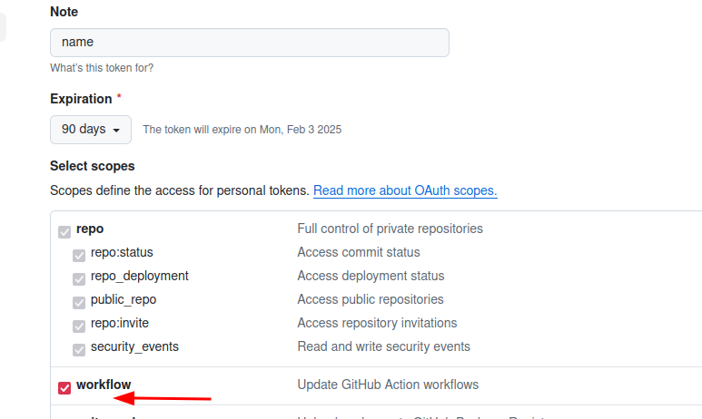
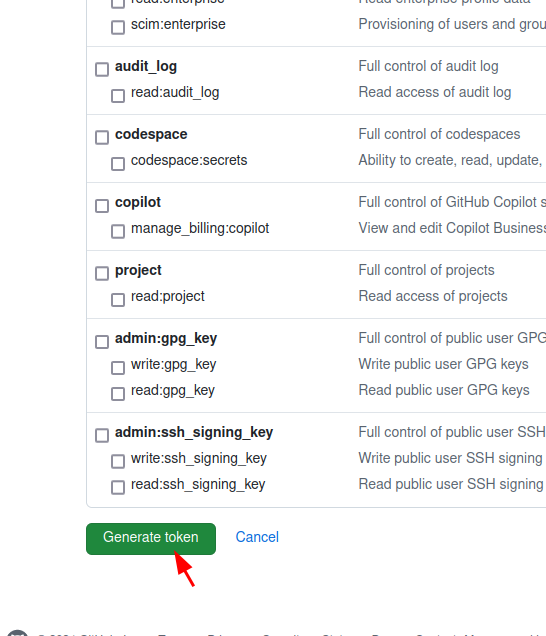
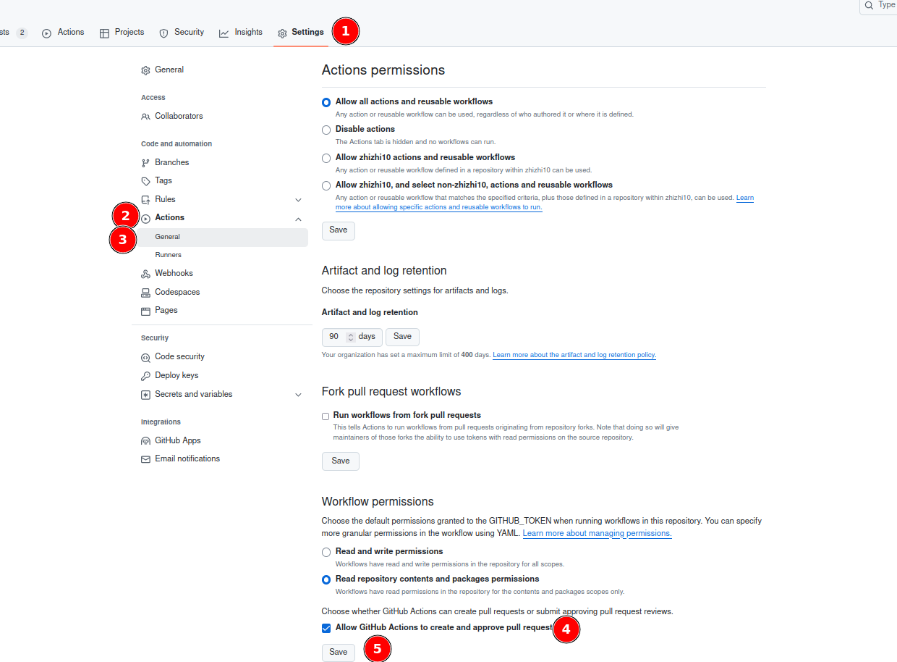
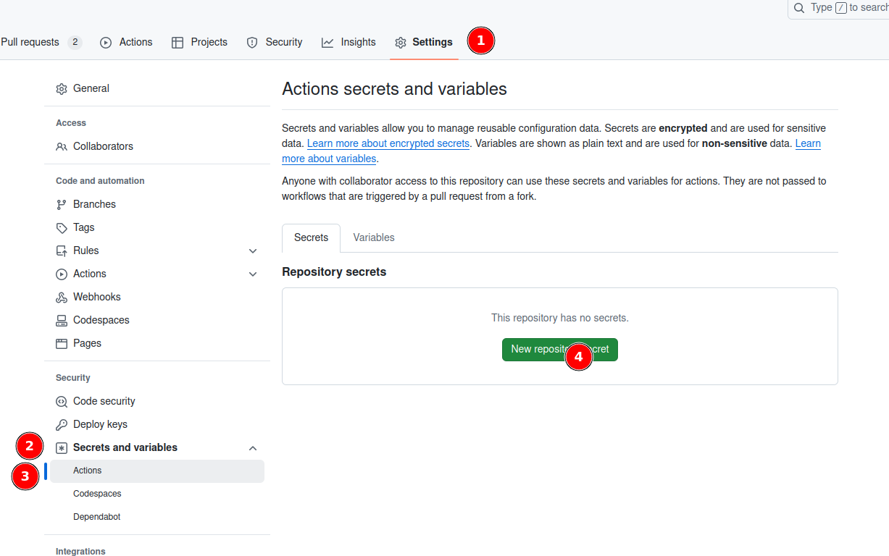
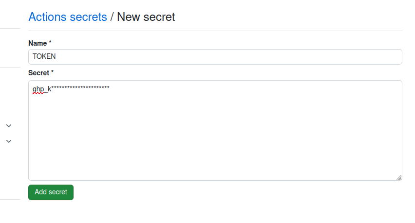

## get github token
  1.github -> Settings -> Developer settings ->Personal access tokens -> Tokens (classic)-> Generate new token(classic)


  
  2.Fill in Note, select the date, select workflow, and click Generate token. save token

 


## set github action 
  1.github repository ->  Settings -> Action -> Generate 
  2.select `Allow GitHub Actions to create and approve pull requests` ,click save




  3.github project ->  Settings -> Secret and variables -> Action -> New repository secrets


  4.name is the TOKEN, Secret is the token saved in the first step, click add `secret`




## configuration file
1.Copy `renovate.json` into your project root directory. Modify all strings whose value is prefixed with `$`
  ```
  $username is github username
  $repository is github repository name
  $name <$email.com> is your name and email
  ```
2.Copy the files under`.github/workflows` into your project

3.Modify `.github/workflows/renovate.yml` to open the cron execution
```  
#push:
#branches:
#- main
 schedule:
 - cron: '0 22 * * *'
```
4.push code
note: If you do not need to merge automatically, delete the merge job in the test.yml file
```
  merge:
    runs-on: ubuntu-latest
    needs: test
    if: |
      github.event.pull_request.merged == false &&
      needs.test.result == 'success'

    steps:
      - id: automerge
        name: automerge
        uses: "pascalgn/automerge-action@v0.16.4"
        env:
          GITHUB_TOKEN: "${{ secrets.TOKEN }}"
          MERGE_LABELS: ""
```
